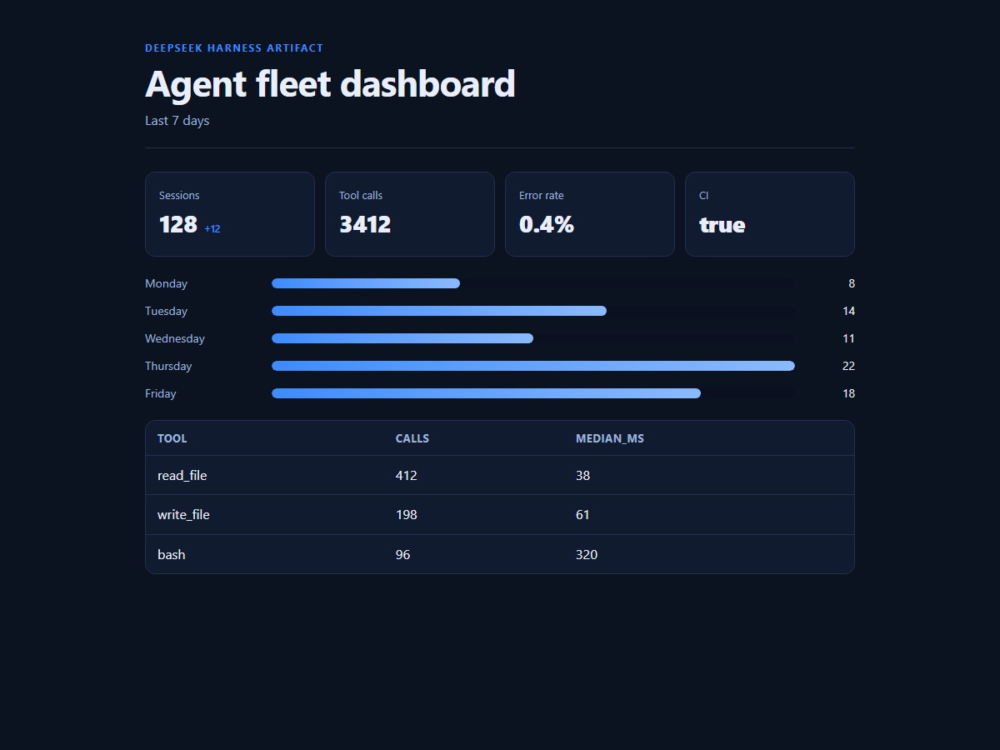
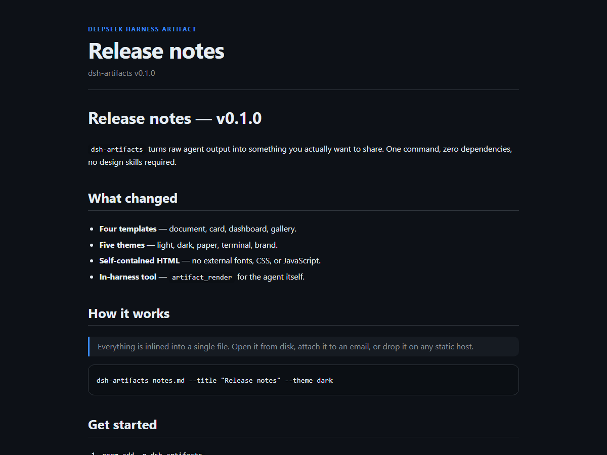
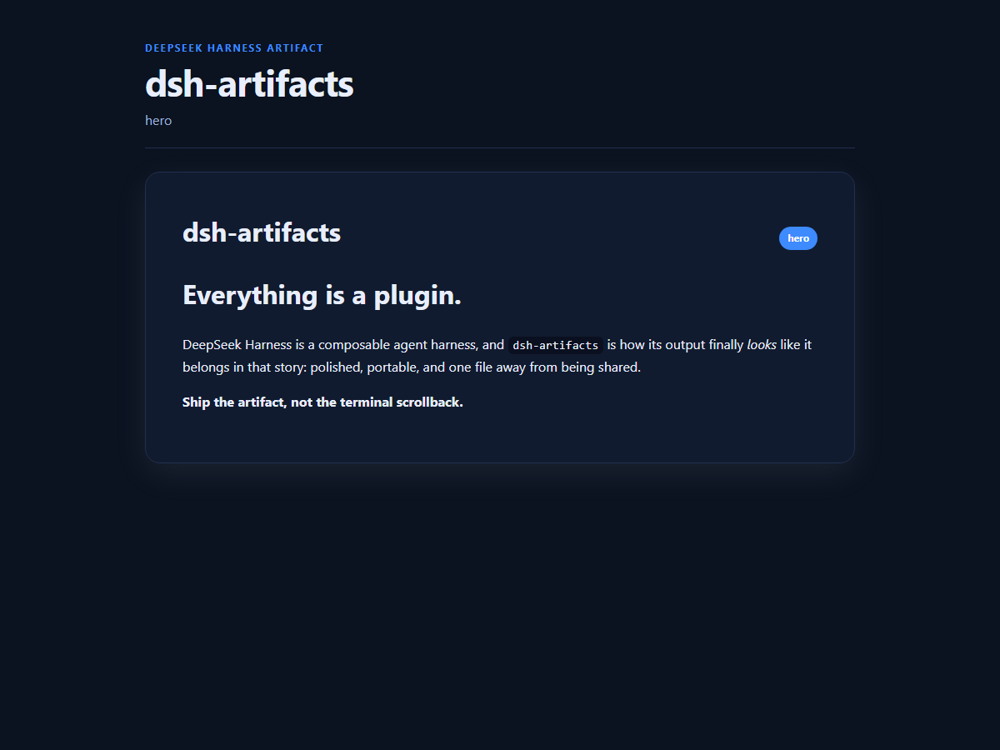
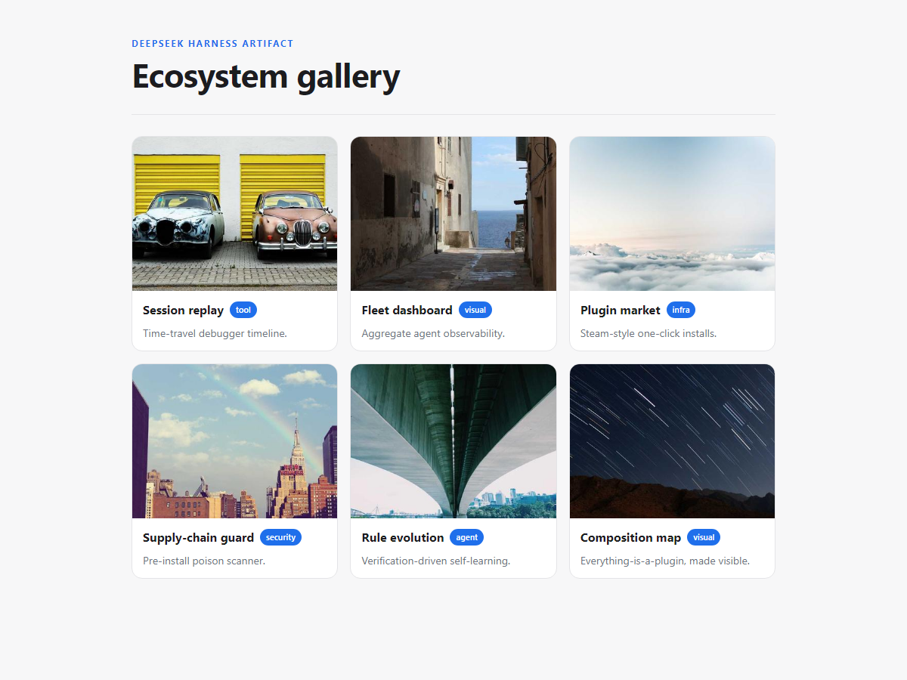

# dsh-artifacts

> **Claude-Artifacts-style rendering for DeepSeek Harness.** Turn raw agent
> output — Markdown + JSON — into beautiful, shareable, self-contained HTML
> documents, cards, dashboards, and galleries. One command. Zero runtime
> dependencies.

[](https://github.com/zoahdev/dsh-artifacts/actions)
[](LICENSE)

English | [中文](#中文)



Your agent produces Markdown and JSON all day. Most of it ends up as unstyled
terminal text that nobody shares. `dsh-artifacts` fixes that: the same content,
rendered as a polished, dependency-free HTML artifact you can open from disk,
attach to an email, or drop on any static host.

**Live demo:** https://zoahdev.github.io/dsh-artifacts/

## Why

- **No design skills required.** Pick a template + theme, get a finished page.
- **Self-contained.** All CSS is inlined — no external fonts, frameworks, or
  tracking. The output works offline and forever.
- **Works two ways.** A CLI for you, and an `artifact_render` tool for the
  agent itself.
- **Zero runtime dependencies.** Node ≥ 18 only; nothing to audit.

## Quick start

```sh
# As a standalone CLI
pnpm add -g dsh-artifacts
dsh-artifacts notes.md --title "Release notes" --theme dark --out notes.html
dsh-artifacts notes.md --serve 8080          # live preview

# Or via npx without installing
npx dsh-artifacts notes.md --theme paper --out notes.html
```

Install as a DeepSeek Harness plugin:

```sh
dsh plugin --profile web add dsh-artifacts
# or, using the upstream CLI directly:
pnpm dlx @deepseek-ai/dsh plugin --profile web add dsh-artifacts
```

Then the agent can call `artifact_render` from chat to write a styled report to
disk and hand you back the path.

## Templates

| Template | Use it for |
| --- | --- |
| `doc` | Prose, notes, reports, README-style content |
| `card` | A single shareable statement / hero card |
| `dashboard` | Metrics, bars, and tables from JSON |
| `gallery` | Image / item grids |

All four templates, rendered from the same demo inputs in this repo:

<table>
  <tr>
    <td></td>
    <td></td>
  </tr>
  <tr>
    <td></td>
    <td></td>
  </tr>
</table>

## Themes

| Theme | Vibe |
| --- | --- |
| `dark` | GitHub-dark, default |
| `light` | Clean light UI |
| `paper` | Warm, editorial serif |
| `terminal` | Green-on-black monospace |
| `brand` | DeepSeek-blue |

## Examples

Document from Markdown:

```sh
dsh-artifacts demo/sample.md \
  --title "Release notes" \
  --subtitle "dsh-artifacts v0.1.0" \
  --theme dark \
  --out release-notes.html
```


Dashboard from JSON:

```sh
dsh-artifacts --data demo/metrics.json \
  --title "Agent fleet dashboard" \
  --template dashboard \
  --theme brand \
  --out dashboard.html
```

```json
{
  "metrics": [
    { "label": "Sessions", "value": 128, "delta": "+12" },
    { "label": "CI", "value": true }
  ],
  "bars": [
    { "label": "Monday", "value": 8 },
    { "label": "Tuesday", "value": 14 }
  ],
  "columns": ["tool", "calls", "median_ms"],
  "rows": [["read_file", "412", "38"]]
}
```

Gallery from JSON:

```sh
dsh-artifacts --data gallery.json --template gallery --theme light
```

```json
{ "items": [ { "title": "A", "image": "https://…/a.png", "tag": "new" } ] }
```

## Vault export (Obsidian / VS Code / any folder of Markdown)

`dsh-artifacts` is not DSH-only. Point it at any folder of `.md` notes — an
Obsidian vault, a VS Code notes directory, blog drafts, or docs — and it
renders one self-contained HTML page per note plus a linked `index.html`:

```sh
dsh-artifacts vault ./my-notes --theme paper --out site
# site/index.html + site/<note>.html
```

The first `# heading` of each note becomes its title; the first meaningful line
becomes the index excerpt. Ignored folders include `node_modules`, `.git`,
`.obsidian`, and `.trash`. Use `--no-recursive` for the top level only.

## In-harness tool

`artifact_render` accepts:

| Parameter | Type | Description |
| --- | --- | --- |
| `title` | string | Document title |
| `subtitle` | string | Subtitle / byline |
| `markdown` | string | Markdown body |
| `data` | string | JSON for `dashboard` / `gallery` |
| `template` | string | `doc` / `card` / `dashboard` / `gallery` |
| `theme` | string | `light` / `dark` / `paper` / `terminal` / `brand` |
| `out` | string | Output path (defaults to a temp file) |

It returns `{ path, bytes, title, template, theme }`.

## Library use

```ts
import { renderArtifact } from 'dsh-artifacts'

const { html } = renderArtifact({
  title: 'Weekly report',
  markdown: '# Shipped',
  template: 'doc',
  theme: 'dark',
})
```

## What CI actually proves

`build → unit tests → pack → install the real tarball into a fresh project →
load the packed bundle → register `artifact_render` via `apply()` →
execute the real handler → assert a real HTML file + rendered output`.

In a second step, CI installs the packed plugin into a fresh `DSH_HOME`
profile, verifies it appears in `--dump-config`, boots the real `dsh web`
server, and asserts HTTP 200.

The smoke test also installs against an old `@deepseek-ai/dsh-tools` RC and
asserts the runtime guard rejects it loudly (instead of failing later).

## Tested with

- `@deepseek-ai/dsh-tools` `^0.1.0-rc.6`
- `@deepseek-ai/cordis` `^4.0.1`
- Node ≥ 18 (CI runs Node 22)

The peer range is declared as a caret range (not a hard pin). At runtime the
plugin refuses to load if the resolved `dsh-tools` version is outside that
tested range.

## Troubleshooting

**Installing the plugin fails with `ERESOLVE` / a peer-dependency conflict
against an older `@deepseek-ai/dsh-tools` RC.**

The plugin is tested against `^0.1.0-rc.6`. If your harness is on an older RC
(for example `0.1.0-rc.5`), upgrade the host first, then install the plugin:

```sh
pnpm dlx @deepseek-ai/dsh --version          # check your version
pnpm dlx @deepseek-ai/dsh plugin --profile web add dsh-artifacts
```

If a package manager still resolves an old RC into the plugin's peer slot, the
plugin throws on load:

```
dsh-artifacts: resolved @deepseek-ai/dsh-tools 0.1.0-rc.5, but this plugin is
tested with ^0.1.0-rc.6. Upgrade DeepSeek Harness to 0.1.0-rc.6 or later, then
reinstall.
```

Upgrade the host environment to `0.1.0-rc.6` (or later) and reinstall; do not
edit the plugin's peer range to "fix" the conflict, because older RCs are not
verified.

## Honest limits

- The Markdown renderer covers the common subset (headings, lists, quotes,
  code, tables, links, images). It is not a full CommonMark implementation.
- Dashboards are static HTML/CSS; there is no JavaScript runtime, streaming, or
  live data binding (the `--serve` mode re-renders on refresh).
- This is a community plugin, not an official DeepSeek product. It is not a
  security boundary and has not been security-audited.

## Publishing checklist

- [x] `pnpm install --frozen-lockfile`
- [x] `pnpm typecheck`
- [x] `pnpm build`
- [x] `pnpm test`
- [x] `pnpm pack`
- [x] packaged plugin loads and `artifact_render` invokes successfully
- [x] bilingual README

---

# 中文

> **给 DeepSeek Harness 的「Claude Artifacts」式渲染。** 把 Agent 产出的
> Markdown + JSON，一键变成漂亮、可分享、自包含的 HTML 文档、卡片、仪表盘和
> 画廊。零运行时依赖。

你的 Agent 整天都在输出 Markdown 和 JSON，但大多数最后都只是没人愿意分享的
终端文本。`dsh-artifacts` 解决这个问题：同样的内容，渲染成干净、自包含的 HTML
产物，可以直接打开、发邮件或放到任意静态站点。

## 特点

- **无需设计能力** — 选模板 + 主题，直接得到成品页面。
- **完全自包含** — CSS 全部内联，不依赖外部字体、框架或追踪脚本，离线永久可用。
- **两种用法** — 命令行给你用，`artifact_render` 工具给 Agent 用。
- **零运行时依赖** — 只需 Node ≥ 18。

## 快速开始

```sh
pnpm add -g dsh-artifacts
dsh-artifacts notes.md --title "发布说明" --theme dark --out notes.html
dsh-artifacts notes.md --serve 8080        # 实时预览
```

作为 DeepSeek Harness 插件安装：

```sh
dsh plugin --profile web add dsh-artifacts
pnpm dlx @deepseek-ai/dsh plugin --profile web add dsh-artifacts
```

## 模板

| 模板 | 用途 |
| --- | --- |
| `doc` | 文档、笔记、报告 |
| `card` | 单张可分享卡片 |
| `dashboard` | JSON 指标、柱状图、表格 |
| `gallery` | 图片 / 条目画廊 |

## 主题

| 主题 | 风格 |
| --- | --- |
| `dark` | GitHub 深色（默认） |
| `light` | 干净浅色 |
| `paper` | 暖色编辑风衬线体 |
| `terminal` | 绿字黑底等宽 |
| `brand` | DeepSeek 蓝 |

## Vault 导出（Obsidian / VS Code / 任意 Markdown 文件夹）

不只用于 DSH。指向任意 `.md` 笔记目录（Obsidian 库、VS Code 笔记、博客草稿、文档），
每条笔记生成一个自包含 HTML 页，外加带链接的 `index.html`：

```sh
dsh-artifacts vault ./my-notes --theme paper --out site
```

## 已验证

- `@deepseek-ai/dsh-tools` `^0.1.0-rc.6`
- `@deepseek-ai/cordis` `^4.0.1`
- Node ≥ 18（CI 使用 Node 22）

## 排障

**安装插件时因旧版 `@deepseek-ai/dsh-tools` RC 出现 `ERESOLVE` / peer 冲突。**

先把宿主环境升级到 `0.1.0-rc.6` 或更新版本，再安装插件；不要靠放宽 peer 范围
来「修复」冲突，因为更旧的 RC 未经验证。插件在加载时若解析到不兼容版本会直接
报错并给出升级提示。

## 诚实边界

- Markdown 渲染覆盖常用子集（标题、列表、引用、代码、表格、链接、图片），并非
  完整 CommonMark。
- 仪表盘是静态 HTML/CSS，没有 JS 运行时、流式或实时数据绑定。
- 这是社区插件，不是 DeepSeek 官方产品，未经安全审计。
